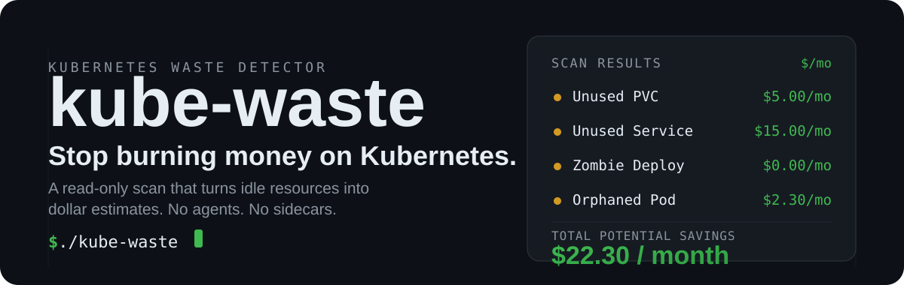
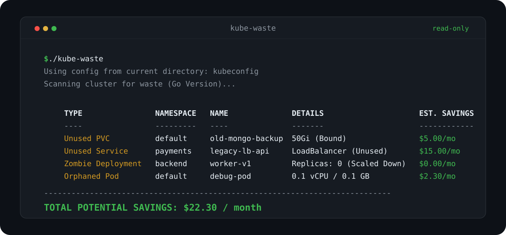
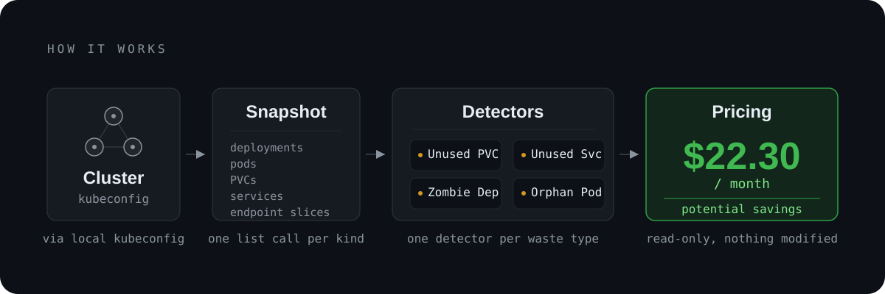

# kube-waste

<p align="center">
  
</p>

**kube-waste** is a lightweight, read-only CLI written in Go that scans your Kubernetes cluster for wasted resources and tells you what they cost each month. No agents. No sidecars. One binary.

> [!NOTE]
> **Experimental.** This tool is under active development and may change or break without notice. Treat all savings estimates as rough guidance — verify against your own cloud bill before acting on them.

## Example output

<p align="center">
  
</p>

<details>
<summary>Raw terminal output</summary>

```
$ ./kube-waste
Using config from current directory: kubeconfig
Scanning cluster for waste (Go Version)...

TYPE               NAMESPACE    NAME                 DETAILS                  EST. SAVINGS
----               ---------    ----                 -------                  ------------
Unused PVC         default      old-mongo-backup     50Gi (Bound)             $5.00/mo
Unused Service     payments     legacy-lb-api        LoadBalancer (Unused)    $15.00/mo
Zombie Deployment  backend      worker-v1            Replicas: 0 (Scaled Down)  $0.00/mo
Orphaned Pod       default      debug-pod            0.1 vCPU / 0.1 GB        $2.30/mo
-------------------------------------------------------------------------
TOTAL POTENTIAL SAVINGS: $22.30 / month
```

</details>

## Quick start

### Download the binary

Grab the latest release for your platform from the [releases page](https://github.com/pkhamre/kube-waste/releases):

```bash
# Linux (AMD64)
curl -LO https://github.com/pkhamre/kube-waste/releases/latest/download/kube-waste-linux-amd64
chmod +x kube-waste-linux-amd64
sudo mv kube-waste-linux-amd64 /usr/local/bin/kube-waste
```

The latest release also ships `kube-waste-darwin-amd64`, `kube-waste-darwin-arm64`, and `kube-waste-windows-amd64.exe` (substitute the filename in the command above).

### Build from source

Requires Go 1.24 or later:

```bash
git clone https://github.com/pkhamre/kube-waste.git
cd kube-waste
go build -o kube-waste .
```

### Run

Point it at a cluster and run — your kubeconfig is detected automatically:

```bash
./kube-waste
```

## What it finds

| Waste type | How it's detected | Est. monthly cost |
| --- | --- | --- |
| **Unused PVC** | A Bound or Pending PVC no pod mounts | $0.10 per GB |
| **Unused Service** | A Service with no backing endpoints (skips `kubernetes`) | $15.00 per LoadBalancer |
| **Zombie Deployment** | A Deployment scaled down to `replicas: 0` | $0.00 (operational waste) |
| **Orphaned Pod** | A running Pod with no owner reference | $20.00 per vCPU + $3.00 per GB RAM |

These are conservative defaults based on major cloud providers (AWS/GCP/Azure), so real savings may be higher or lower.

## How it works

<p align="center">
  
</p>

kube-waste reads a **snapshot** of your cluster with your local kubeconfig: deployments, pods, PVCs, services, and endpoint slices. One detector per waste type runs over that snapshot, then pricing converts each finding into a monthly dollar estimate.

- **100% safe** — read-only list calls; nothing is ever modified.
- **Resilient** — if a resource type can't be listed, only the detectors that depend on it are skipped; everything else still runs.
- **Fast** — scans thousands of resources in milliseconds.
- **Single static binary** — no runtime dependencies, works on Linux, macOS, and Windows.

## Kubeconfig resolution

The tool looks for kubeconfig in this order:

1. `./kubeconfig` (current directory)
2. `./.kubeconfig` (current directory, hidden)
3. `~/.kube/config` (home directory)
4. `$KUBECONFIG` environment variable

## Development

### Project structure

```
.
├── main.go                  # CLI entry point, kubeconfig resolution, table output
├── pkg/
│   └── analyzer/
│       ├── cluster.go       # ClusterReader — fetches a snapshot from the cluster
│       ├── snapshot.go      # Snapshot — raw lists of every watched kind
│       ├── scanner.go       # Scan — runs every detector, collects results & errors
│       ├── refs.go          # Refs — reference relations over a snapshot
│       ├── pricing.go       # Pricing — converts usage into $/month
│       ├── types.go         # WasteItem, WasteType, Usage
│       ├── pod.go           # Orphaned pod detection
│       ├── pvc.go           # Unused PVC detection
│       ├── service.go       # Unused service detection
│       └── deployment.go    # Zombie deployment detection
├── CONTEXT.md               # Domain glossary
└── AGENTS.md                # Development guidelines
```

### Build & test

```bash
# Build
go build -o kube-waste .

# Run
./kube-waste

# Test
go test ./...

# Format
go fmt ./...

# Lint
go vet ./...
```

See [AGENTS.md](AGENTS.md) for detailed coding guidelines.

## Limitations

- **Metrics-free**: analyzes configuration, not actual usage patterns
- **Stateless**: no historical tracking between runs
- **Pricing estimates**: generic cloud pricing, not your specific rates
- **Permissions**: needs read access to pods, services, deployments, PVCs, and endpoint slices

## Roadmap

- [ ] JSON/CSV export formats
- [ ] Custom cost configuration via flags
- [ ] Historical tracking & trend analysis
- [ ] Automated Slack/email alerts
- [ ] Support for StatefulSets and DaemonSets
- [ ] Integration with cloud provider APIs for exact pricing

## Contributing

Contributions welcome! Please:

1. Fork the repository
2. Create a feature branch
3. Follow the guidelines in [AGENTS.md](AGENTS.md)
4. Submit a pull request

## License

MIT License — see [LICENSE](LICENSE) for details

---

**Disclaimer**: This tool provides estimates only. Always verify actual costs with your cloud provider before making infrastructure changes.
